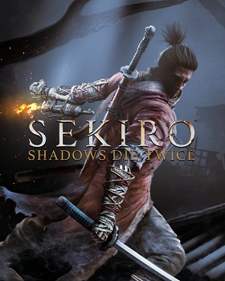

# _Sekiro: Shadows Die Twice_

## Describtion 
* Developer: [FromSoftware Inc.](https://en.wikipedia.org/wiki/FromSoftware)
* Platforms: [PlayStation 4](https://pl.wikipedia.org/wiki/PlayStation_4), [Xbox One](https://en.wikipedia.org/wiki/Xbox_One), [Microsoft Windows](https://en.wikipedia.org/wiki/Microsoft_Windows)
* Initial release date: March 22, 2019
### Release information
Sekiro: Shadows Die Twice is a 2019 action-adventure game developed by FromSoftware. It was released in Japan by FromSoftware and internationally by Activision for the PlayStation 4, Windows and Xbox One in March 2019 and for Stadia in October 2020.  
### Synopsis
During the late Sengoku period, the Ashina clan, led by Kensei Isshin Ashina, seizes a land rich in divine favor, including a foreign deity dubbed the Divine Dragon which can grant immortality through a bloodline dubbed the "Dragon's Heritage" and through the Rejuvenating waters and its mukade-infested Sediment. During this time, a nameless orphan is adopted by the wandering shinobi Owl, who names the boy "Wolf" and trains him in his ways. As Wolf grows up, Owl entrusts him with safeguarding the young lord Kuro, the last of the Dragon's Heritage line.  

### Gameplay
Players control Wolf, a shinobi who embarks on a quest to rescue his lord, and becomes embroiled into a conflict for Ashina's fate.  
The gameplay is focused on stealth, exploration, and combat, with a particular emphasis on boss battles. It takes place in a fictionalized Japan during the Sengoku period and makes strong references to Buddhist mythology and philosophy. Lead director Hidetaka Miyazaki wanted to create a new intellectual property (IP) that marked a departure from their Dark Souls series, wanting to make a Japanese-themed game around shinobi and ninja. Tenchu, as an IP tied to FromSoftware and with that history theme, ended up being the impetus for the project.  
### Opinions from critics
| Nomination    | Year |
| -------- | ------- |
| Game Of The Year  | 2019    |
| The Game Award for Best Art Direction | 2019   |
| NME Award for Best Game    | 2020    |
| BAFTA Games Award for Best Game | 2020|
|  BAFTA Games Award for Technical Achievement | 2020|
|  BAFTA Games Award for Animation| 2020|
| British Academy Games Award for Game Design| 2020|
| The Game Award for Best Game Direction| 2019|
| The Game Award for Best Audio Design|2019|
| The Game Award for Best Action/Adventure|2019|
Sekiro received acclaim from critics, who praised its gameplay and setting and compared it favorably to FromSoftware's past work, although opinions on its heavy difficulty were mixed. It won several year-end awards, including the Game Award for Game of the Year, and has sold over ten million units as of September 2023.
# Development

## About developers and previous projects
Development of Sekiro began in late 2015 following the completion of Bloodborne's downloadable content, The Old Hunters. It was directed by Hidetaka Miyazaki, who had previously worked on the Dark Souls series and Bloodborne. Sekiro draws inspiration from the Tenchu series of stealth-action games developed by Acquire and published by FromSoftware. The team initially considered developing the game as a sequel to Tenchu; however, it quickly outgrew the concept. Miyazaki intended the combat changes to capture the feel of "swords clashing", with fighters trying to create an opening to deliver the fatal strike. He and the team also created the game to be an entirely single-player experience, as they believed multiplayer to have limitations they wanted to avoid.[7] Despite the game taking place during the Sengoku period of real-world Japanese history, no historical people or locations are featured in the game.  
## Worth mentioning 
The game was revealed via a teaser trailer at the Game Awards 2017 in December, showing the tagline "Shadows Die Twice". The game's full title was revealed to be Sekiro: Shadows Die Twice during Microsoft's press conference at E3 2018. The game was published by Activision worldwide, with FromSoftware self-publishing it in Japan and Cube Game publishing in the Asia-Pacific region. Sekiro's soundtrack was composed by Yuka Kitamura, with some contributions from Noriyuki Asakura. The game was released for PlayStation 4, Windows and Xbox One on 22 March 2019. A collectors edition was also released the same day and included a steelbook case, a figurine of the protagonist, an art book, a physical map of the game's world, a download code for the soundtrack, and in-game coin replicas. A port for Stadia was released in late 2020. On 31 October 2020, a free update was released that added new content to the game, such as new cosmetics for Wolf and a boss rush game mode.
